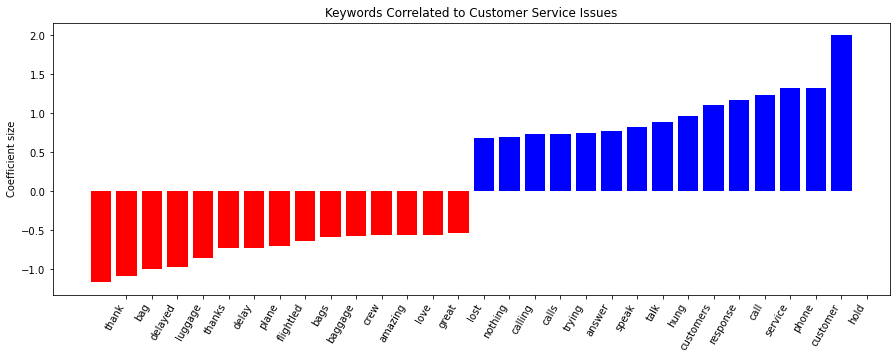

# text-mining-with-airline-tweets
> Text mining on tweets and identify those related to customer service

## Table of Contents
* [General Info](#general-information)
* [Libraries Used](#Libraries-used)
* [Screenshots](#Screenshots)
<!-- * [Room for Improvement](#room-for-improvement)
* [Acknowledgements](#acknowledgements) -->

## General Information
Tweets are a great source of feedbacks. If companies leverage the Twitter API to fetch tweets mentioning them, they can understand how customers feel about their products and improve accordingly.

However, there could be tens of thousands of tweets everyday. To filter out feedbacks which are related to a certain department, text mining and logistic regression can be deployed. 

In this project, I used a dataset of tweets mentioning Trans-American Airline and build models to find those that are related to 'customer service issues'.

## Libraries Used
- pandas
- sklearn
- numpy
- matplotlib

## Screenshots

<!-- ## Room for Improvement
Include areas you believe need improvement / could be improved. Also add TODOs for future development.

Room for improvement:
- Improvement to be done 1
- Improvement to be done 2

## Acknowledgements
Give credit here.
- This project was inspired by...
- This project was based on [this tutorial](https://www.example.com).
- Many thanks to... -->